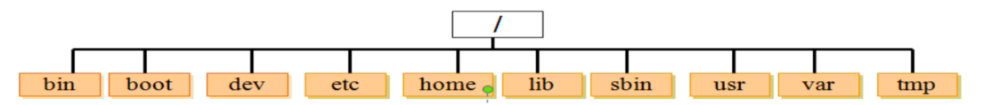
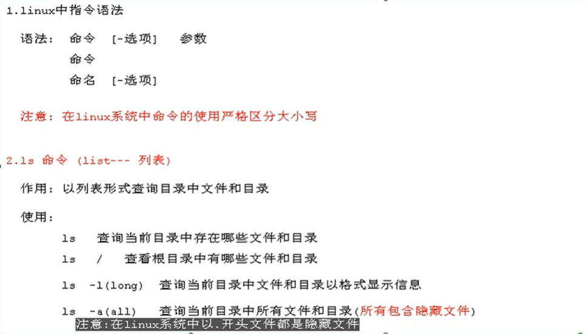
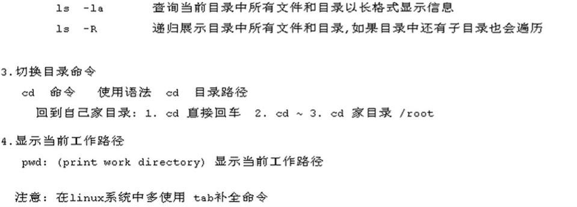

# linux常用命令

## linux中目录结构

```shell
# 目录结构	
	bin  (binaries)存放二进制可执行文件																								 [重点]
	sbin  (super user binaries)存放二进制可执行文件，只有root才能访问
	etc (etcetera)存放系统配置文件																										[重点]
	usr  (unix shared resources)用于存放共享的系统资源  																[重点]
	home 存放用户文件的根目录																													 [重点]
	root  超级用户目录																															  [重点]
	dev (devices)用于存放设备文件
	lib  (library)存放跟文件系统中的程序运行所需要的共享库及内核模块
	mnt  (mount)系统管理员安装临时文件系统的安装点
	boot 存放用于系统引导时使用的各种文件
	tmp  (temporary)用于存放各种临时文件																							  [重点]
	var  (variable)用于存放运行时需要改变数据的文件

```
## linux中常用指令
```shell
# Linux中命令格式:
命令  -选项  参数    如:  ls -l /usr 
```
### ls命令



### 操作系统命令
```shell
# 0.cd 用来切换目录
# 1.pwd 显示当前工作目录（print working directory）
# 2.touch 创建空文件		 
# 3.mkdir 创建目录（make directoriy）
			-p 父目录不存在情况下先生成父目录 （parents）            
# 4.cp 复制文件或目录（copy）
      cp  文件名    目录   复制文件到指定目录中
      cp  -r 目录名    目录   复制指定目录到指定目录中
			-r 递归处理，将指定目录下的文件与子目录一并拷贝（recursive）     
# 5.mv 移动文件或目录、文件或目录改名（move）
			mv 文件名    新文件名      文件改名
			mv 文件名    目录名     	文件移动
			mv 目录名    不存在目录名  目录改名   
      mv 目录名	  已存在目录名  目录移动
# 6.rm 删除文件（remove）
			-r 同时删除该目录下的所有文件（recursive）
			-f 强制删除文件或目录（force）
# 7.rmdir 删除空目录（remove directoriy）
# 8.cat 显示文本文件内容 （catenate） 用来展示少量内容
# 9.more、less 分页显示文本文件内容   退出用q退出
# 10.head、tail查看文本中开头或结尾部分的内容
		head  -n  5  a.log 查看a.log文件的前5行
# 11.tail  -f  b.log 循环读取（fellow）
# 12.echo 输出命令
			echo   I love baby								说明:用来向屏幕输出一句话
			echo I Love baby  >>  aa.txt			说明:将这段内容输入到 文件中
```

